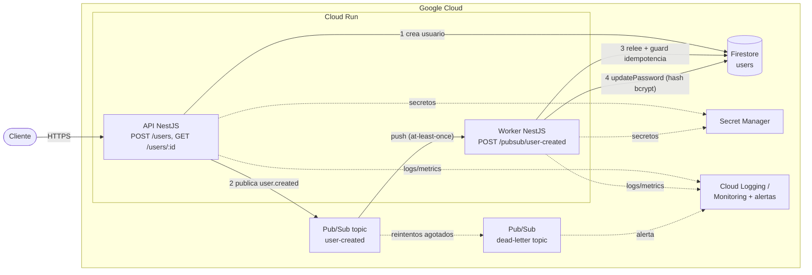
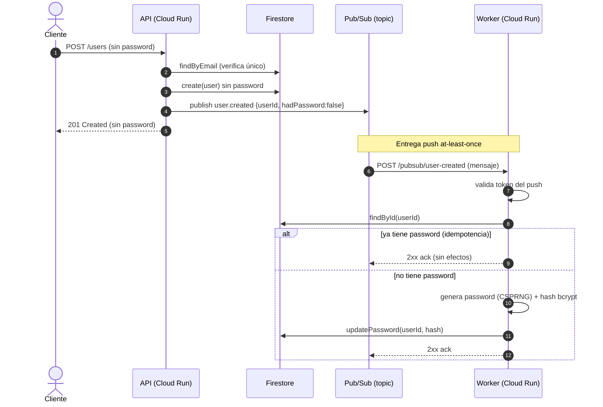
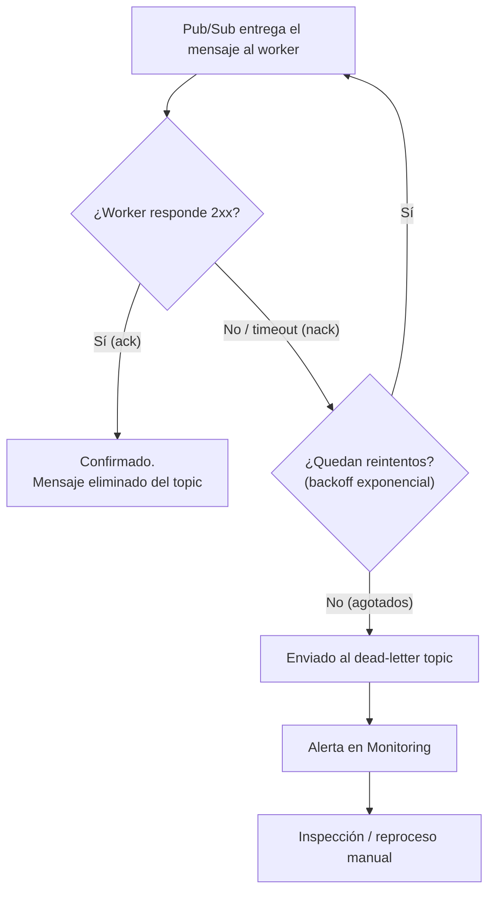
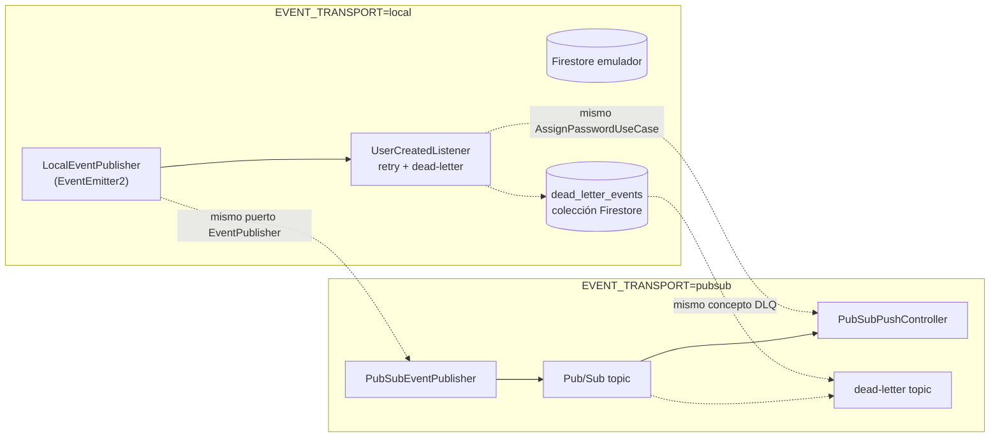
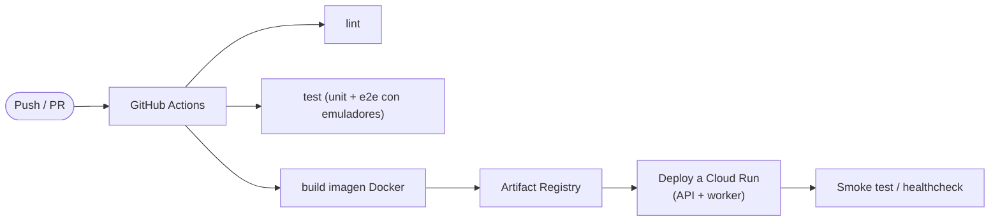

# Arquitectura en GCP (propuesta productiva)

Propuesta de despliegue del challenge en Google Cloud. El **transporte Pub/Sub del evento ya está implementado** en el código (seleccionable con `EVENT_TRANSPORT=pubsub`); lo no implementado es la **infraestructura de despliegue** (Cloud Run, IAM, Secret Manager, CI/CD).

> Los diagramas usan Mermaid; GitHub los renderiza de forma nativa.

## 1. Vista general

**Puntos clave**

- **Cloud Run (API)**: escala automático (incluso a cero), HTTPS gestionado, autenticación a Firestore vía service account (sin llaves en el código).
- **Pub/Sub**: entrega *at-least-once*, reintentos con backoff y *dead-letter topic* nativos. Sustituye al `EventEmitter2` del modo local.
- **Cloud Run (worker)**: recibe el push y ejecuta `AssignPasswordUseCase`, idempotente por diseño.
- **Secret Manager**: credenciales y secretos (p. ej. el token del push), nunca en el repo.
- **Observabilidad**: métricas/logs y **alerta sobre la dead-letter queue** para detectar eventos no procesados.

## 2. Secuencia del flujo `user.created`

El `201` se devuelve al cliente sin esperar al worker: la generación del password ocurre de forma asíncrona. El `password` **nunca** viaja en la respuesta.

## 3. Reintentos y dead-letter (Pub/Sub)

El consumidor debe ser **idempotente** porque *at-least-once* implica posibles entregas duplicadas: reprocesar el mismo evento no debe reasignar el password. Ese guard ya existe (`AssignPasswordUseCase` no sobrescribe un password ya asignado), y es el mismo tanto en el modo local como en Pub/Sub.

## 4. Mapeo local ↔ GCP

Gracias a los puertos (`EventPublisher`, `DeadLetterStore`) y al guard de idempotencia compartido, cambiar de modo **no toca los casos de uso**: solo se intercambian adaptadores vía `EventsModule.forRoot()`.

## 5. CI/CD

Pipeline con lint + pruebas + build de imagen → Artifact Registry → deploy a Cloud Run. Las pruebas e2e pueden correr en CI con `firebase emulators:exec`.

---

Para probar el transporte Pub/Sub en local (emulador), ver [pubsub-local.md](pubsub-local.md).
